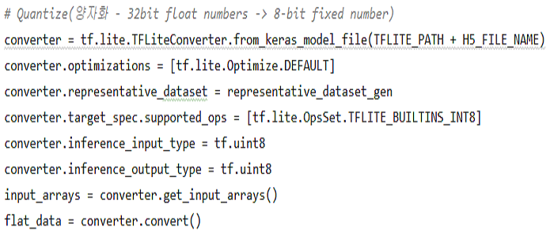
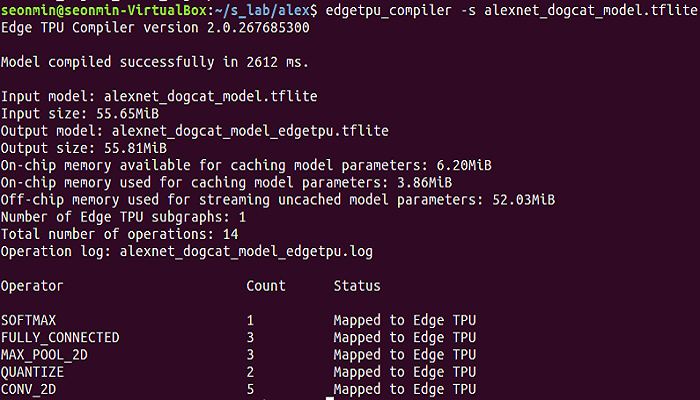
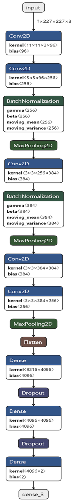
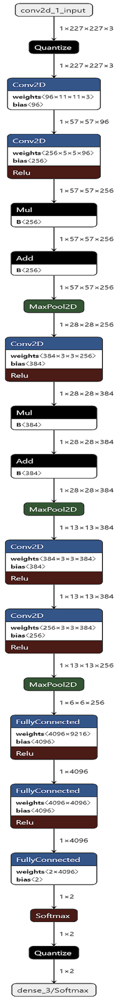

# Google_Coral_Edgetpu_USBAccelerator
### 구글 Coral USB Accelerator & Raspiberry Pi 3 B+
- 라즈베리파이 3 B+ 에서 구글 Coral USB Accelerator를 이용하여 커스텀 모델(Custom Model / Own Model) 작동시키기
- Google TPU 기반의 Coral USB Accelerator를 사용하기 위해선 양자화(bit 맞추기), 컴파일러 등 많은 것을 맞춰주어야 함.   

### 환경셋팅 (Environment Setting)   
(1) Python 3.5.2 / Tensorflow 1.15 / keras 2.3.1 (그냥 최신 버전 깔면 됨)   
(2) EdgeTPU Compiler 2.0 / EdgeTPU Runtime 12   
(3) Ubuntu 16.04 (EdgeTPU Compiler 역할)   
(4) Rasberry Pi 3 B+ (라즈베리파이 3 B+ 추론 역할, stretch)   
(5) Google Coral USB Accelerator   

### 환경셋팅 - 주의사항
(1) -> 실험 날짜 기준 20년 2월 기준 TF 2.0 버전에서는 오류가 많이 발생하여. 1.1X 버전대를 추천함.    
(1) -> 단 1.13, 1.14, 1.15 모두 Converter 방식이 다르며 수많은 시행착오 끝에 해당 글에서는 1.15으로 진행 (타 버전 1.13? 도 된다고는 들었는데 해당 글은 1.15로 진행)   
(1) -> Tensorflow 모델로 진행하는 것이 원래 더 정석. keras로 진행시 작동은 잘 되지만 특이한 이슈 있음.   
(2) -> Compiler는 공식 Coral 홈페이지에서는 Debian 기반에서는 작동된다고 되있으나, Raspberry Pi OS (Stretch or Buster.. 등)에서 Edge TPU Compiler가 작동하지를 않는 이슈 있음.   
(2) -> 일부 유저는 라즈베리파이 위에 Docker를 깔아 진행하여 가능하다고도 함. 필자는 Virtual Box에 Ubuntu 16.04 로 진행하였음.   
(2) -> EdgeTPU Compiler가 2.0일 때 runtime version 12 / 1.0일때 runtime version 10 . 잘 맞춰줘야 함. 상황에 따라 업그레이드 필요.   
(2) -> EdgeTPU Runtime 12 기본 공식 홈페이지 가이드 or 기타예제 를 따를시? Edge TPU Runtime 이 낮은 버전이 설치되던가 그럼. 낮은버전일 경우 제대로 컴파일 하지를 못함 최신버전 업데이트 필수    
(3) -> 우분투 버전은 아마 상관없을 것으로 생각. 이미지 있는게 16.04라 16.04로 진행하였음.   
(4) -> 라즈베리파이 OS 버전은 Stretch나 Buster이나 상관없는 것 같긴한데, Buster 버전 에서 두어번인가 실패해서 Stretch로 하였음.   
(5) -> Coral USB Accelerator는 기본적으로 USB 3.0을 지원함. Raspberry Pi 3 B+는 2.0 이기 때문에 Raspberry PI 4 에서 작동시 더 성능이 좋아질 것임.   

### 실행절차
[1] 케라스를 이용한 모델 생성 (.h5 파일) // 텐서플로우 모델도 변환 가능함.   
[2] TFLite Convert를 이용한 Keras Model (.h5) -> Quantized (양자화) -> .tflite 모델변환   
[3] Ubuntu 에 Edge TPU Compiler 설치 및 edgetpu로 Compile   
[4] 라즈베리파이에서 변환된 .tflite 모델 이용 추론 진행   

#### 실행절차 - [1] 케라스를 이용한 모델 생성 (alexnet_train_dogcat(1).py -> alexnet_dogcat_model.h5 생성)
- 해당 깃에서는 모델을 따로 올리지는 않았습니다. 직접 케라스로 학습한 아무모델 (.h5) 이나 사용 가능합니다. 모든 주된 오류는 TFLiteConverter 옵션 설정에서 발생.
- 모든 코드는 참조위주로 할 것을 권장.
- 캐글의 Dog & Cat Dataset을 활용하여 alexnet 베이스의 모델 훈련 / 변환이 잘 되는 지를 확인하기 위한 목적이여서 정확도는 크게 의의를 두지 않고, 학습을 적게 시켰음.   

#### 실행절차 - [2] TFLite Converter를 이용한 .h5 모델 -> .tflite 모델 변환 (alexnet_convert_tflite(2).py 실행 -> alexnet_dogcat_model.tflite 생성)
- Google Coral USB Accelerator (TPU 환경)에서 돌리기 위해서는 Quantize(양자화)를 해주어야 함.
- Quantize 부분이 제일 까다롭고 옵션이 하나라도 비틀어지면? 안되는 아주 쉽지않음.
- tflite converter 핵심 code 사진 

#### 실행절차 - [3] Ubuntu 에 Edge TPU Compiler 설치 및 edgetpu로 Compile (alexnet_dogcat_model.tflite -> alexnet_dogcat_model_edgetpu.tflite 생성
- VirtualBox에 Ubuntu 16.04를 설치하고, EdgeTPU 설치 및 Compile

#### 실행절차 - [4] [라즈베리파이]에서 Coral USB Accelerator로 추론 진행 (alexnet_inference(3).py 진행)
- Coral API 홈페이지 및 예제들 보고 코드 작성
- python3 alexnet_dogcat(1).py --model=alexnet_dogcat_model.tflite --alexnet_dogcat_model_edgetpu.tflite --label=dogcat_testlabel.csv

### 참고링크
#### 참고링크 - [1] 설치 및 양자화 (Install & Quantize) 
- https://www.pyimagesearch.com/2019/04/22/getting-started-with-google-corals-tpu-usb-accelerator/ (구글 코랄 TPU USB Accelerator 설치 edgetpu 최신버전 제공 & python 가상환경) + 홈페이지 설치 오류 발생시 sudo pip3 install libatlas-base-dev 추가 진행 필요 (20.01.16 기준)
- https://seongkyun.github.io/others/2019/05/09/ubuntu_python/ (파이썬 버전 변경)
- https://mazdah.tistory.com/853 (한글 블로그 글 설명 잘나와있으며 Coral EdgeTPU 개념, 변환방식 등 개념잡기 좋음)
- https://www.tensorflow.org/lite/convert/quantization (양자화 기본필수코드 1)
- https://www.tensorflow.org/lite/guide/ops_select (양자화 converter서 옵션들 설명)
- https://www.tensorflow.org/lite/convert/python_api (양자화 Converter tf 1.x 내용)
- https://coral.ai/docs/edgetpu/models-intro/#quantization (양자화 훈련은 2.0은 제공하지 않고 1.15 tf에서만 제공함 + 양자화에 대한 자세한 설명들)
- https://github.com/tensorflow/tensorflow/blob/master/tensorflow/lite/g3doc/r1/convert/python_api.md (TF 제공 - Converter Python API guide 기본개념용)
- https://gist.github.com/Namburger/4cc57ab3cbe4bf5abbc1d3e84536b75c (Coral & MNIST 양자화 소스예제)   

#### 참고링크 - [2] 장비 스펙 및 기타정보
- https://coral.ai/models/ (Edge TPU 모델 설명 및 종류)
- https://coral.ai/docs/edgetpu/benchmarks/ (Edge TPU 성능)
- https://coral.ai/docs/edgetpu/models-intro/ (edgetpu 설명 및 조건)
- https://coral.ai/docs/edgetpu/compiler/#compiler-and-runtime-versions (EdgeTPU Compiler 구체적내용들)
- https://towardsdatascience.com/google-coral-edge-tpu-board-vs-nvidia-jetson-nano-dev-board-hardware-comparison-31660a8bda88 (Coral edge TPU vs NVIDIA Jetson Nano Dev Board)   

#### 참고링크 - [3] 구글 코랄 API 
- https://coral.ai/docs/reference/edgetpu.basic.basic_engine/ (구글 코랄 API 엔진 코드 작성시 공부 필요)
- https://github.com/NobuoTsukamoto/edge_tpu_mnist/blob/master/classify/classify_mnist.py (깃허브 mnist 예제 참고 많이 하였음)   

#### 참고링크 - [4] 기타 프로젝트 링크 (not own model)
- https://webnautes.tistory.com/909 (webcam 연결하기)
- https://blog.xcoda.net/103 (라즈베리카메라 연길 및 + 객체인식(Object Detection) 
- https://github.com/google-coral/edgetpu-platforms (edgetpu-platform git 아마 edgetpu설치된 os를 제공하는 것 같음 후에 rasberrypi4 사용시 참고)
- https://gilberttanner.com/blog/googles-coral-ai-edge-hardware-out-of-beta-overview-of-all-the-changes (pb파일 방법 + 기본 tf 2.0 소스코드 제공)   

#### 참고링크 - [5] 관련 이슈 및 오류
- https://github.com/tensorflow/tensorflow/issues/21429 (keras_model_file 의 input shapes 이슈 - input이 1 x width x height x channel 로 고정되는 문제)
- https://github.com/f0cal/google-coral/issues/20 (필요한 온갖 팁들)
- https://ko.programqa.com/question/55475551/ (toco_from_protos: command not found 오류)
- https://coral.ai/docs/edgetpu/compiler/#compiler-and-runtime-versions (Failed precondition: Package requires runtime version (12), which is newer than this runtime version (10).오류)
- TPU는 하나도 사용되지 않고 CPU만 사용되는 경우 -> runtime version이 낮아서 그런것일 수도 있음. 컴파일러 버전 높은버전으로 재설치 필요 (*컴파일러 버전 2.0 -> 필요 runtime 12 / 컴파일러 버전 1.0 -> 필요 런타임 1.0)
 
#### 모델 사진
#### - alexnet_dogcat_model.png (by Netron)   

#### - alexnet_dogcat_model_tflite.png (by Netron)   
